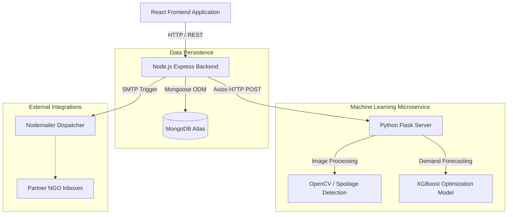

<div align="center">
  
  
  
</div>

<br />

<div align="center">
  <h1 align="center">PerishPro</h1>
  <p align="center">
    <strong>AI-Driven Grocery Spoilage Management & Dynamic Pricing Platform</strong>
    <br />
    Reduce food waste, maximize revenue, and automate Corporate Social Responsibility (CSR) workflows.
  </p>
</div>

<hr />

## Table of Contents
- [About the Project](#about-the-project)
- [System Architecture](#system-architecture)
- [Core Features](#core-features)
- [Technology Stack](#technology-stack)
- [Getting Started](#getting-started)
- [Environment Variables](#environment-variables)
- [License](#license)

---

## About the Project

PerishPro is an enterprise-grade retail management solution engineered specifically for supermarkets and grocery chains to combat the financial and environmental impacts of food waste. 

By integrating Machine Learning (XGBoost) and Computer Vision (OpenCV) within a microservices architecture, the platform actively monitors inventory freshness, automatically calculates and applies dynamic discounts to aging stock, and routes unsellable (but safe) food to local charities. This creates a sustainable operational lifecycle that reduces landfill waste, boosts retailer profitability, and ensures rigorous compliance with CSR accounting standards.

---

## System Architecture



---

## Core Features

### 1. Computer Vision Freshness Analysis
A dedicated computer vision pipeline for automated quality assurance.
- **Image Processing:** Store managers upload images of produce via the dashboard. The backend proxies the image buffer securely to the Python Flask microservice.
- **Spoilage Classification:** The model utilizes OpenCV (GrabCut algorithms and HSV color space thresholding) to isolate the product from the background and calculate a precise "Browning Index".
- **Dynamic Metadata Adjustment:** Based on the calculated index, the system assigns a Spoilage Risk (Low, Medium, High, Critical) and applies a reduction factor to the product's remaining shelf-life. If the risk is deemed 'Critical', the database strictly flags the item as 'expired' to prevent consumer purchase.

### 2. AI-Powered Price Optimization
A robust dynamic pricing engine designed to balance inventory clearance with profit maximization.
- **XGBoost Regression Model:** Trained on historical retail datasets, the model ingests base product features (full price, base stock levels, historical popularity) alongside real-time operational data (current inventory count, exact days to expiry).
- **Demand Forecasting:** The ML model predicts the optimal discount percentage required to maximize the "Sell-Through Rate" for aging goods.
- **Financial Projections:** The system calculates and exposes both the "Projected Waste Value" (if left at full price) and the "Optimized Waste Value", explicitly showing the financial impact of the AI's recommendation before execution.

### 3. Corporate Social Responsibility (CSR) Donation Hub
An integrated logistics and accounting module for surplus food redistribution.
- **Automated Dispatching:** Managers utilize a multi-step UI wizard to select visually imperfect but completely safe inventory. Upon confirmation, the backend handles transactional database updates to instantly deduct the specific stock quantities.
- **SMTP Notification System:** Nodemailer is configured to automatically generate and dispatch professional HTML email alerts to partner NGOs (e.g., Feeding India Hub) containing pickup logistics and a detailed tabular manifest of the donated goods.
- **Tax Compliance Manifests:** To adhere to rigorous accounting standards, the frontend leverages jsPDF to generate client-side PDF manifests. These receipts document the exact CSR write-off valuation based on the original cost price, providing necessary documentation for tax deductions.

### 4. Smart Inventory Tracking and Actionable Analytics
A comprehensive operational dashboard for store managers.
- **Proactive Alerts:** The system continuously evaluates current stock against baseline popularity metrics to generate automated Restocking Alerts, preventing stockouts while highlighting items nearing their expiration date.
- **Data Visualization:** Built with Recharts, the analytics page aggregates historical pricing actions, visualizing critical performance indicators such as Total Revenue and Total Waste Value Saved across the retail lifecycle.

---

## Technology Stack

- **Frontend:** React, TypeScript, Vite, TailwindCSS, Framer Motion, Lucide-React, Recharts, jsPDF.
- **Backend:** Node.js, Express.js, MongoDB (Mongoose), JSON Web Tokens (JWT), Nodemailer, Multer.
- **Machine Learning:** Python, Flask, XGBoost, OpenCV, Scikit-Learn, Pandas, Joblib.

---

## Getting Started

Follow these instructions to configure and run the project locally.

### Prerequisites
- [Node.js](https://nodejs.org/en/) (v18 or higher)
- [Python](https://www.python.org/) (v3.9 or higher)
- [MongoDB](https://www.mongodb.com/) (Local instance or Atlas Cluster)

### 1. Clone the Repository
```bash
git clone https://github.com/Snehalgupta-07/SDA_Project.git
cd SDA_Project
```

### 2. Configure the Python ML Server
```bash
cd Model
# Create a virtual environment (optional but recommended)
python -m venv venv
# Activate the environment (Windows)
venv\Scripts\activate
# Install dependencies
pip install -r requirements.txt
# Run the Flask API (runs on port 8000 by default)
python app.py
```

### 3. Configure the Node.js Backend
```bash
# Open a new terminal
cd Backend
npm install
# Start the server (runs on port 5000 by default)
npm start
```

### 4. Configure the React Frontend
```bash
# Open a new terminal
cd Frontend
npm install
# Start the Vite development server
npm run dev
```

---

## Environment Variables

Create a `.env` file inside the `Backend/` directory. Use the following template to configure your deployment:

```env
# Backend Configuration
PORT=5000
NODE_ENV=development

# Database & Security
MONGODB_URL=mongodb://127.0.0.1:27017/perishpro
JWT_KEY=your_super_secret_jwt_key_here

# Microservice Endpoints
ML_API_URL=http://127.0.0.1:8000

# Email Dispatcher (Optional: Falls back to Ethereal Mock if omitted)
# SMTP_HOST=smtp.gmail.com
# SMTP_PORT=465
# SMTP_USER=your_email@gmail.com
# SMTP_PASS=your_app_password
```

---

<div align="center">
  <p>Built for a more sustainable retail future.</p>
</div>