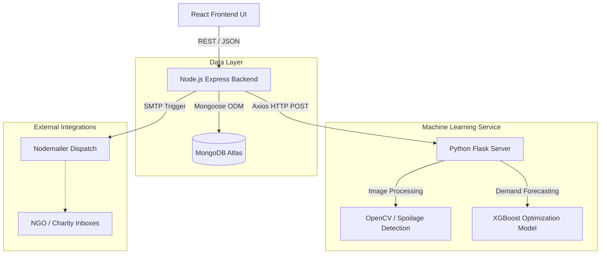

<div align="center">
  
  
  
</div>

<br />

<div align="center">
  <h1 align="center">PerishPro ♻️</h1>
  <p align="center">
    <strong>AI-Driven Grocery Spoilage Management & Dynamic Pricing Platform</strong>
    <br />
    Reduce food waste, maximize revenue, and automate Corporate Social Responsibility (CSR).
  </p>
</div>

<hr />

## 📖 Table of Contents
- [About the Project](#about-the-project)
- [Key Features](#key-features)
- [Architecture & Tech Stack](#architecture--tech-stack)
- [Project Structure](#project-structure)
- [Getting Started](#getting-started)
- [Environment Variables](#environment-variables)
- [Contact](#contact)

---

## 🌟 About the Project

**PerishPro** is an enterprise-grade retail management solution designed specifically for supermarkets and grocery stores to combat the global food waste crisis. 

By leveraging **Machine Learning (XGBoost)** and **Computer Vision (OpenCV)**, the platform actively monitors inventory freshness, automatically applies dynamic discounts to aging stock to stimulate sales, and routes unsellable (but safe) food to local charities. This creates a sustainable cycle that reduces landfill waste, boosts retailer profitability, and supports community welfare.

---

## 🚀 Key Features

### 1. 🔍 Computer Vision Mould Detection (Freshness Analysis)
Upload an image of produce directly from the dashboard. The Python Flask ML server uses OpenCV to evaluate the **Browning Index** and **Spoilage Risk**. The system instantly adjusts the calculated shelf-life and automatically flags items as 'expired' or 'critical' if deemed unsafe for consumption.

### 2. 📉 AI-Powered Price Optimization
Uses a trained **XGBoost** regression model to analyze:
- **Days to Expiry**
- **Inventory Stock Levels**
- **Historical Popularity**

It predicts the exact optimal discount percentage required to maximize "Sell-Through Rate" while minimizing financial losses. Retailers can simulate different pricing scenarios directly from the UI.

### 3. 🤝 Corporate CSR Donation Hub
When products are visually imperfect (e.g., heavily bruised) but completely safe to eat, managers can dispatch them to the **Donation Hub**.
- **Automated Dispatching:** Deducts stock instantly and uses `Nodemailer` to fire HTML email alerts to partner NGOs (e.g., Feeding India Hub).
- **Tax Compliance Manifests:** Automatically generates in-browser **PDF Manifests** using `jsPDF`, detailing the CSR Write-off Value for strict accounting and tax deduction purposes.

### 4. 🔔 Smart Inventory & Alerts
Tracks the lifecycle of perishable goods. The system evaluates current stock against baseline popularity and generates **Restocking Alerts** to prevent stockouts while aggressively highlighting items nearing expiration.

### 5. 📊 Real-Time Analytics Dashboard
Comprehensive data visualization (built with Recharts) showcasing Total Revenue, Projected Waste Values, Inventory Status, and Total Wastage Saved natively. 

---

## 🏗️ Architecture & Tech Stack



### 💻 Technology Stack
- **Frontend:** React, TypeScript, Vite, TailwindCSS, Framer Motion, Lucide-React, Recharts, jsPDF.
- **Backend:** Node.js, Express.js, MongoDB (Mongoose), JWT Auth, Nodemailer, Multer.
- **Machine Learning:** Python, Flask, XGBoost, OpenCV, Scikit-Learn, Pandas.

---

## ⚙️ Getting Started

Follow these steps to set up the project locally on your machine.

### Prerequisites
- [Node.js](https://nodejs.org/en/) (v18 or higher)
- [Python](https://www.python.org/) (v3.9 or higher)
- [MongoDB](https://www.mongodb.com/) (Local instance or Atlas Cluster)

### 1. Clone the Repository
```bash
git clone https://github.com/Snehalgupta-07/SDA_Project.git
cd SDA_Project
```

### 2. Set up the Python ML Server
```bash
cd Model
# Create a virtual environment (optional but recommended)
python -m venv venv
# Activate the environment (Windows)
venv\Scripts\activate
# Install dependencies
pip install -r requirements.txt
# Run the Flask API (runs on port 8000 by default)
python app.py
```

### 3. Set up the Node.js Backend
```bash
# Open a new terminal
cd Backend
npm install
# Start the server (runs on port 5000 by default)
npm start
```
*(Ensure you have created a `.env` file in the Backend directory based on the Environment Variables section below).*

### 4. Set up the React Frontend
```bash
# Open a new terminal
cd Frontend
npm install
# Start the Vite development server
npm run dev
```

---

## 🔐 Environment Variables

You will need to create a `.env` file inside the `Backend/` directory. Use the following template:

```env
# Backend Configuration
PORT=5000
NODE_ENV=development

# Database & Security
MONGODB_URL=mongodb://127.0.0.1:27017/perishpro
JWT_KEY=your_super_secret_jwt_key_here

# Microservice Endpoints
ML_API_URL=http://127.0.0.1:8000

# Email Dispatcher (Optional: Falls back to Ethereal Mock if omitted)
# SMTP_HOST=smtp.gmail.com
# SMTP_PORT=465
# SMTP_USER=your_email@gmail.com
# SMTP_PASS=your_app_password
```

---

<div align="center">
  <p>Built with ❤️ for a more sustainable future.</p>
</div>